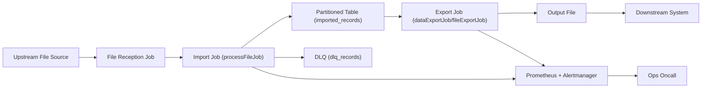

# Architecture
> 中文名：系统架构说明

## 关键组件
- 调度层：`TaskSchedulerService` + `task_definition`/`task_trigger`（支持CRON/FIXED_RATE/ONE_TIME）。
- 执行层：Spring Batch Job/Step + 任务处理器。
- 治理层：状态机、去重、重试、DLQ、重放与恢复重启。
- 可观测层：Micrometer/Prometheus 指标 + JSON 日志 + 告警规则。
