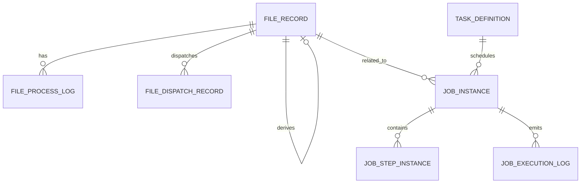

# 阶段 1 详细设计：统一领域模型

日期：2026-03-15  
范围：为后续“文件资产主表、文件状态机、任务实例服务、补偿统一化”建立统一领域模型，不直接改当前生产主链路。  
配套实施计划见：[批量调度系统补齐实施计划](../operations/system-capability-completion-plan.md)

## 1. 设计目标

阶段 1 的目标不是马上替换现有表，而是先把系统的核心业务对象定清楚，避免后面继续在旧表上叠逻辑。

本阶段要解决的问题：

- 文件到底是“目录里的文件”，还是“系统受管资产”
- 任务到底是“Quartz/Spring Batch 执行记录”，还是“业务任务实例”
- 状态字段到底谁说了算，状态如何迁移
- 文件、任务、分发、补偿之间如何关联

本阶段输出必须能支撑后续阶段：

- 阶段 2：文件资产主表
- 阶段 3：文件状态机
- 阶段 5：任务实例服务
- 阶段 6：重试补偿统一化

## 2. 设计边界

### 2.1 本阶段纳入设计的对象

- 文件资产
- 文件处理日志
- 文件分发记录
- 业务任务实例
- 任务步骤实例
- 任务执行日志
- 文件状态
- 任务状态

### 2.2 本阶段明确不做的事

- 不直接替换 Quartz JDBC
- 不替换 Spring Batch 元数据表
- 不删除 `file_reception_queue` / `file_distribution_task`
- 不一次性把所有查询切到新表
- 不立即实现完整运维台页面

## 3. 当前结构与目标结构

## 3.1 当前结构

当前系统的核心链路大致是：

- 任务配置：
  - `task_definition`
  - `task_trigger`
  - `task_parameter`
- 编排状态：
  - `task_execution_state`
  - `task_execution_audit`
- 批处理技术执行：
  - `batch_run_records`
  - Spring Batch 元数据表
- 文件接收：
  - `file_reception_queue`
- 文件分发：
  - `file_distribution_task`
- 链路追踪：
  - `record_trace`
- 失败治理：
  - `dlq_records`

问题在于：

- 文件模型是割裂的
- 任务实例模型是割裂的
- 运行状态分散在多个表里
- 旧表更偏“技术实现数据”，不够“业务语义清晰”

## 3.2 目标结构

目标结构分两层：

### 第一层：业务主模型

- `file_record`
- `file_process_log`
- `file_dispatch_record`
- `job_instance`
- `job_step_instance`
- `job_execution_log`

### 第二层：底层执行与兼容模型

- `task_definition`
- `task_trigger`
- `task_parameter`
- `task_execution_state`
- `task_execution_audit`
- `batch_run_records`
- Spring Batch 元数据表
- Quartz `qrtz_*`
- `file_reception_queue`
- `file_distribution_task`
- `record_trace`
- `dlq_records`

原则是：

- 新表负责业务主语义
- 旧表先保留，继续承接当前实现或底层技术运行数据

## 4. 现有表到目标模型的映射

| 当前表/对象 | 未来定位 | 是否保留 |
| --- | --- | --- |
| `file_reception_queue` | 入站接收队列/兼容表 | 保留，逐步弱化 |
| `file_distribution_task` | 出站分发工作队列/兼容表 | 保留，逐步弱化 |
| `record_trace` | 记录级链路追踪与辅助审计 | 保留 |
| `task_execution_state` | 编排态/调度态 | 保留 |
| `task_execution_audit` | 编排审计事件 | 保留 |
| `batch_run_records` | 技术执行统计表 | 保留 |
| Spring Batch 元数据 | 框架执行元数据 | 保留 |
| Quartz 元数据 | 调度框架元数据 | 保留 |
| `dlq_records` | 失败补偿池 | 保留 |
| `file_record` | 文件资产主表 | 新增 |
| `file_process_log` | 文件处理过程日志 | 新增 |
| `file_dispatch_record` | 文件分发与回执主表 | 新增 |
| `job_instance` | 业务任务实例主表 | 后续新增 |
| `job_step_instance` | 业务步骤实例表 | 后续新增 |
| `job_execution_log` | 任务执行日志表 | 后续新增 |

## 4.1 现有状态到目标状态映射

### `file_reception_queue` -> `file_record`

| 旧状态 | 新状态 | 说明 |
| --- | --- | --- |
| `RECEIVED` | `ARRIVED` | 文件已登记，但还未完成完整性/可处理性判定 |
| `WAITING` | `ARRIVED` | 仍视为已到达文件，等待原因写入 `metadata.waitReason` 或 `file_process_log.extra` |
| `PROCESSING` | `PROCESSING` | 正在被批处理链路消费 |
| `COMPLETED` | `PROCESSED` | 入站处理完成 |
| `FAILED` | `FAILED` | 文件处理失败，等待补偿或人工介入 |

说明：

- 旧表里的 `WAITING` 不单独扩成新状态，原因是它更像“未达到 READY 条件”，不是独立生命周期终态。
- `READY` 是新增的受控状态，只在完整性检查、半文件检查、命名规则检查都通过后进入。

### `file_distribution_task` -> `file_dispatch_record`

| 旧状态 | 新状态 | 说明 |
| --- | --- | --- |
| `PENDING` | `PENDING` | 已建逻辑分发记录，待发起传输 |
| `IN_PROGRESS` | `DISPATCHING` | 分发执行中 |
| `SUCCESS` | `SUCCESS` | 逻辑分发成功 |
| `FAILED` | `FAILED` | 已失败且达到当前失败结论 |
| `RETRY` | `RETRY_PENDING` | 等待下次自动或人工重试 |

说明：

- `file_dispatch_record` 把“分发状态”和“回执状态”拆开，避免一个字段同时表达发送结果和回执结果。
- 当前旧表没有 ACK 维度，因此阶段 2 不做回填推断，只默认 `ack_status=NOT_REQUIRED`。

### 当前编排/技术表的保留定位

| 当前表 | 保留角色 | 不承担的职责 |
| --- | --- | --- |
| `task_execution_state` | 编排运行态、依赖阻断、重试窗口 | 不作为最终业务任务实例主视图 |
| `task_execution_audit` | 编排事件审计 | 不记录文件全生命周期 |
| `batch_run_records` | Spring Batch 技术执行统计 | 不承担业务补偿模型 |

## 5. 目标领域对象定义

## 5.1 文件资产域

### 5.1.1 FileRecord

职责：

- 表示系统中一个受管文件资产
- 统一承载入站文件、出站文件、中间文件
- 作为文件状态机的主实体

建议关键属性：

- `fileNo`
- `sourceSystem`
- `bizType`
- `fileDirection`
- `originalName`
- `storedName`
- `storedPath`
- `storageType`
- `fileSize`
- `fileHash`
- `hashAlgorithm`
- `fileExt`
- `mimeType`
- `charset`
- `bizDate`
- `batchNo`
- `tenantId`
- `bizDomain`
- `parentFileId`
- `versionNo`
- `latestVersion`
- `status`
- `archiveRequired`
- `archived`
- `deletable`
- `deletedFlag`
- `arrivedTime`
- `readyTime`
- `processingStartTime`
- `processedTime`
- `archivedTime`

设计原则：

- `originalName` 用于追踪来源名
- `storedName` / `storedPath` 用于真实存储位置
- `fileNo` 是全局可见主编号
- `versionNo` 用于版本化，而不是覆盖同名文件
- `parentFileId` 用于表达“由哪个文件衍生而来”

### 5.1.2 FileProcessLog

职责：

- 记录文件每个关键处理动作
- 是文件状态变化的审计日志

建议关键属性：

- `fileRecordId`
- `stepName`
- `actionType`
- `statusFrom`
- `statusTo`
- `result`
- `taskId`
- `jobName`
- `jobExecutionId`
- `stepExecutionId`
- `operator`
- `runKey`
- `retryNo`
- `errorCode`
- `errorMsg`
- `startedAt`
- `finishedAt`
- `extra`

设计原则：

- 状态流转不只写主表，还要写过程日志
- 失败要记录到步骤粒度
- 后续补跑、补偿、审计都依赖这张表

### 5.1.3 FileDispatchRecord

职责：

- 记录文件发往目标系统的逻辑分发记录
- 承载回执、重试、幂等、版本快照

建议关键属性：

- `dispatchNo`
- `dispatchKey`
- `fileRecordId`
- `legacyDistributionTaskId`
- `targetSystem`
- `dispatchChannel`
- `targetAddress`
- `fileVersionNo`
- `dispatchStatus`
- `ackStatus`
- `attemptCount`
- `maxAttempts`
- `ackRequired`
- `lastDispatchTime`
- `nextRetryAt`
- `ackTime`
- `errorCode`
- `errorMsg`

设计原则：

- 这是逻辑分发表，不要求和旧 `file_distribution_task` 一一等价
- `dispatchKey` 用于保证同一版本文件对同一目标的逻辑幂等

## 5.2 业务任务实例域

### 5.2.1 JobInstance

职责：

- 表示一次业务任务实例
- 不是 Quartz 触发记录，也不是 Spring Batch 技术执行记录
- 是运维和业务视角看到的“这次任务”

建议关键属性：

- `jobInstanceNo`
- `taskId`
- `jobName`
- `triggerSource`
- `operator`
- `bizDate`
- `batchNo`
- `status`
- `rerunFlag`
- `retryFlag`
- `manualFlag`
- `relatedFileId`
- `requestPayload`
- `resultSummary`
- `startTime`
- `endTime`

### 5.2.2 JobStepInstance

职责：

- 表示业务任务中的步骤实例
- 用于表达“这次任务执行到了哪一步、哪一步失败了”

建议关键属性：

- `jobInstanceId`
- `stepCode`
- `stepName`
- `stepOrder`
- `status`
- `attemptNo`
- `startTime`
- `endTime`
- `errorCode`
- `errorMsg`

### 5.2.3 JobExecutionLog

职责：

- 记录任务实例层面的日志和事件
- 不是技术日志文件替代品，而是结构化事件日志

建议关键属性：

- `jobInstanceId`
- `jobStepInstanceId`
- `eventType`
- `level`
- `message`
- `operator`
- `payload`
- `createdAt`

## 6. 主标识与幂等键设计

## 6.1 文件主标识

建议：

- 主键：`id`
- 业务编号：`file_no`

建议格式：

- `FR-YYYYMMDD-xxxxxxxx`

例如：

- `FR-20260315-9A42C1D0`

### 为什么需要 file_no

- DB 自增 ID 适合内部关联，不适合对外显示
- `file_no` 更适合日志、运维界面、工单沟通、审计追踪

## 6.2 文件幂等键

建议幂等判定优先级：

1. `source_system + file_hash + biz_date`
2. 必要时再叠加 `batch_no`

说明：

- 不建议只用文件名判重
- 不建议一开始就把版本化和幂等混成一套约束
- 第一阶段应以“识别重复/冲突”为主，不急着硬约束所有情况

## 6.3 分发幂等键

建议：

- `dispatch_key = file_no + version_no + target_system + dispatch_channel + target_address`

说明：

- 同一文件版本对同一目标只应有一个逻辑分发记录
- 重发是 attempt 增加，不是新增另一条逻辑分发记录

## 6.4 任务实例编号

建议：

- `job_instance_no`
- 格式：`JI-YYYYMMDD-xxxxxxxx`

说明：

- 便于和 `jobExecutionId`、`taskId` 区分
- 运维操作不应长期只靠 Spring Batch executionId

## 7. 状态模型设计

## 7.1 文件状态模型

建议状态：

- `UPLOADING`
- `ARRIVED`
- `READY`
- `PROCESSING`
- `PROCESSED`
- `FAILED`
- `DISPATCHING`
- `DISPATCHED`
- `ARCHIVED`

### 状态含义

| 状态 | 含义 |
| --- | --- |
| `UPLOADING` | 文件正在上传，尚不可消费 |
| `ARRIVED` | 文件已到达，但尚未通过可处理判定 |
| `READY` | 文件已通过完整性校验，可进入处理 |
| `PROCESSING` | 文件正在被批处理消费 |
| `PROCESSED` | 文件处理完成 |
| `FAILED` | 文件处理失败，需要补偿或人工介入 |
| `DISPATCHING` | 文件正在向下游发送 |
| `DISPATCHED` | 文件已完成逻辑分发 |
| `ARCHIVED` | 文件已归档，进入长期保留或冷存储 |

### 建议合法迁移

- `UPLOADING -> ARRIVED`
- `ARRIVED -> READY`
- `ARRIVED -> FAILED`
- `READY -> PROCESSING`
- `PROCESSING -> PROCESSED`
- `PROCESSING -> FAILED`
- `PROCESSED -> DISPATCHING`
- `DISPATCHING -> DISPATCHED`
- `DISPATCHING -> FAILED`
- `PROCESSED -> ARCHIVED`
- `DISPATCHED -> ARCHIVED`
- `FAILED -> READY` 仅在人工确认或补偿重置后允许

### 不允许的迁移示例

- `UPLOADING -> PROCESSED`
- `FAILED -> DISPATCHED`
- `ARCHIVED -> PROCESSING`

## 7.2 任务实例状态模型

建议状态：

- `PENDING`
- `TRIGGERED`
- `RUNNING`
- `PARTIAL_SUCCESS`
- `COMPLETED`
- `FAILED`
- `RETRY_PENDING`
- `RERUN_PENDING`
- `CANCELLED`
- `TIMEOUT`

### 状态含义

| 状态 | 含义 |
| --- | --- |
| `PENDING` | 已创建实例但未触发 |
| `TRIGGERED` | 已被调度接收 |
| `RUNNING` | 任务正在执行 |
| `PARTIAL_SUCCESS` | 部分步骤成功，部分失败 |
| `COMPLETED` | 任务完成 |
| `FAILED` | 任务失败 |
| `RETRY_PENDING` | 等待自动/人工重试 |
| `RERUN_PENDING` | 等待补跑 |
| `CANCELLED` | 人工取消 |
| `TIMEOUT` | 执行超时 |

## 8. 目标关系图

说明：

- `FILE_RECORD -> FILE_RECORD` 是父子文件关系，例如导出文件由处理结果生成
- `FILE_RECORD -> JOB_INSTANCE` 是业务关联，不代表必须一对一

## 9. 关键业务流设计

## 9.1 入站文件流

1. 外部系统上传文件
2. 系统创建 `file_record(status=UPLOADING/ARRIVED)`
3. 校验上传完成条件
4. 完整性检查通过后置为 `READY`
5. 调度任务消费该文件
6. 任务开始时置为 `PROCESSING`
7. 成功后置为 `PROCESSED`
8. 失败则置为 `FAILED`

## 9.2 处理任务流

1. 调度器决定触发
2. 创建 `job_instance`
3. 写入 `TRIGGERED`
4. Spring Batch 启动
5. 每个步骤创建或更新 `job_step_instance`
6. 同步 `job_execution_log`
7. 结束后汇总为 `COMPLETED / FAILED / PARTIAL_SUCCESS`

## 9.3 出站分发流

1. 导出作业生成 `file_record(file_direction=OUTBOUND)`
2. 创建 `file_dispatch_record`
3. 分发开始时置 `dispatch_status=DISPATCHING`
4. 成功则置 `dispatch_status=SUCCESS`
5. 等待回执时更新 `ack_status`
6. 失败则更新 `attemptCount / nextRetryAt / errorCode`

## 9.4 阶段 2 双写顺序

### 入站文件

建议顺序：

1. 先生成 `file_no`
2. 写 `file_record`
3. 写 `file_reception_queue(file_record_id=...)`
4. 写 `file_process_log(action_type=RECEIVE, status_to=ARRIVED)`

原因：

- `file_record` 是未来主模型，编号和元数据应先稳定下来
- 旧表只作为兼容接收队列，不应成为新的事实来源

失败处理原则：

- 若第 2 步失败，则整体回滚
- 若第 3 步失败，则回滚 `file_record`
- 若第 4 步失败，不回滚主表，但必须记录错误日志并由补偿任务补写

### 出站文件/分发

建议顺序：

1. 导出作业生成物理文件
2. 写 `file_record(file_direction=OUTBOUND)`
3. 写 `file_dispatch_record`
4. 写 `file_distribution_task(file_record_id=...)`
5. 写 `file_process_log(action_type=DISPATCH_PREPARE, status_to=PROCESSED/DISPATCHING)`

原因：

- `file_dispatch_record` 才是未来逻辑分发主记录
- `file_distribution_task` 继续保留给当前调度/重试链路使用

## 10. 与现有实现的兼容策略

## 10.1 旧表保留策略

短期保留：

- `file_reception_queue`
- `file_distribution_task`

原因：

- 这两张表当前已经被任务链路直接使用
- 一次性切走风险高

### 阶段 2 的兼容方案

- 新增 `file_record`
- 在旧表上补 `file_record_id`
- `FileReceptionService` 双写：
  - 旧表写接收队列
  - 新表写文件资产
- `FileDistributionService` 双写：
  - 旧表写分发任务
  - 新表写分发记录

## 10.2 任务实例兼容方案

短期内：

- `task_execution_state` 继续承载编排运行态
- `batch_run_records` 继续承载技术执行统计
- `job_instance` 建成后承载业务主视图

说明：

- `job_instance` 不替代 Spring Batch 元数据
- `job_instance` 也不替代 `task_execution_state`
- 三者职责不同，不能强行合表

## 10.3 读路径切换里程碑

建议按 3 个里程碑推进：

1. 阶段 2：只做双写
2. 阶段 3-4：管理台和排障查询优先读新表，主执行链路继续读旧表
3. 阶段 5-7：当任务实例与文件状态机稳定后，逐步把主查询和补偿入口切到新表

切换前置条件：

- 新表双写覆盖率达到 100%
- 新旧主键关联无孤儿记录
- 文件接收、导出、分发、补偿至少各有 1 组集成测试
- 运维查询页面能直接按 `file_no` 和 `job_instance_no` 排障

## 11. 服务层建议

## 11.1 阶段 2 需要新增的服务

- `FileAssetService`
  - 创建文件资产
  - 查询文件资产
  - 更新文件资产元数据
- `FileProcessLogService`
  - 写文件过程日志
- `FileDispatchRecordService`
  - 创建分发记录
  - 更新分发状态

## 11.2 阶段 3 需要新增的服务

- `FileLifecycleService`
  - 统一状态迁移
  - 校验合法迁移
  - 写入日志

## 11.3 阶段 5 需要新增的服务

- `JobInstanceService`
- `JobStepInstanceService`
- `JobExecutionLogService`

## 12. 测试策略

### 阶段 1 设计确认后，阶段 2 至少要补：

- `file_record` Repository 测试
- `FileReceptionService` 双写测试
- `FileDistributionService` 双写测试
- 导出链路写文件资产测试
- 文件状态迁移单测

### 阶段 5 后要补：

- `job_instance` 创建/结束/失败联动测试
- 文件与任务关联测试
- 补偿重跑时的实例关联测试

## 13. 设计验收清单

阶段 1 设计评审通过前，至少要确认以下问题已经定稿：

- `file_record` 是否作为所有入站/出站文件的唯一主模型
- 旧 `WAITING` 是否保留为旧表兼容态，不进入新状态枚举
- 分发 ACK 是否独立于发送状态表达
- `job_instance` 是否只承载业务视图，不替代 Spring Batch/Quartz 元数据
- 双写顺序是否统一采用“先新后旧”
- 阶段 2 是否只加桥接列，不做旧表退役

## 14. 本阶段输出结论

阶段 1 的核心结论只有两条：

1. 文件必须升级为统一文件资产模型，不能继续只靠 `file_reception_queue` / `file_distribution_task` 表达全生命周期。
2. 任务必须补业务任务实例层，不能继续只靠 Quartz 和 Spring Batch 的技术元数据充当业务视图。

后续阶段应基于这个模型推进，不再重复讨论“文件是不是单独建主表”“任务实例是否需要单独建模”这两个问题。
